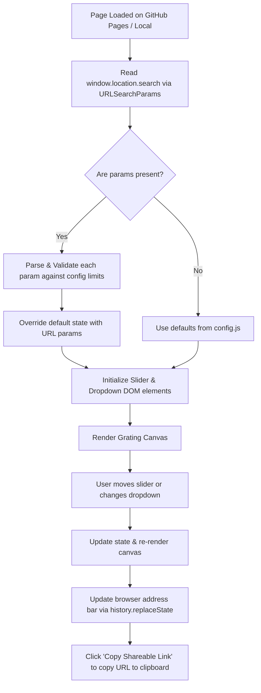

# Implementation Plan: URL Query Parameter Support for GitHub Pages

**File**: `agy_plan.md`  
**Workspace**: `/Users/alex/Documents/Teaching/3013_PerceptualSystems/gratingsVibeCoded`  
**Rule Compliance**: Saved in workspace with `agy` and `plan` in filename; substantive parameters and parameter mappings in `config.js`.

---

## 1. Goal Description

Add URL query parameter support (`?param=value&...`) so that any configuration of sliders and dropdowns can be loaded directly from a URL (e.g. for GitHub Pages deployment: `https://<username>.github.io/gratingsVibeCoded/?minSpatialFreqCpd=0.1&contrastScale=logarithmic`).

Additionally:
- Live-update the browser URL bar using `history.replaceState` as sliders and dropdowns change, allowing instant sharing of the current stimulus state.
- Add a "Copy Shareable Link" button in the sidebar for one-click sharing.
- Support both exact parameter names and convenient short aliases (case-insensitive) for ease of manual URL crafting.

---

## 2. Technical & Architecture Design

### 2.1 Supported Parameters and Aliases

Every interactive control will be configurable via URL query parameters:

| Parameter Key | Controls | Type / Allowed Values | Aliases Accepted |
| :--- | :--- | :--- | :--- |
| `stripHeight` | Strip thickness (px) | Integer ($1\text{ to }40$) | `strip_height`, `sh`, `strip` |
| `maxContrast` | Bottom strip contrast | Float ($0.0\text{ to }1.0$) | `max_contrast`, `contrast`, `c` |
| `contrastScale` | Contrast spacing | `'linear'`, `'logarithmic'` | `contrast_scale`, `c_scale` |
| `minSpatialFreqCpd` | Min spatial freq (cpd) | Float ($0.03\text{ to }15.0$) | `min_sf`, `minsf`, `sf_min` |
| `deltaSpatialFreqCpd` | Spatial freq range (cpd) | Float ($0.0\text{ to }25.0$) | `delta_sf`, `sf_range`, `sf_delta`, `max_sf`* |
| `spatialFreqScale` | Spatial spacing | `'linear'`, `'logarithmic'` | `sf_scale`, `spatial_scale` |
| `viewingDistanceCm` | Viewing distance (cm) | Integer/Float ($20\text{ to }80$) | `viewing_distance`, `dist`, `distance` |
| `gratingWidthCm` | Grating width (cm) | Integer/Float ($5\text{ to }60$) | `grating_width`, `width`, `w` |
| `minTemporalFreq` | Min temporal freq (Hz) | Float ($0.0\text{ to }50.0$) | `min_tf`, `mintf`, `tf_min` |
| `deltaTemporalFreq` | Temporal freq range (Hz) | Float ($0.0\text{ to }50.0$) | `delta_tf`, `tf_range`, `tf_delta`, `max_tf`* |
| `temporalFreqScale` | Temporal spacing | `'linear'`, `'logarithmic'` | `tf_scale`, `temporal_scale` |
| `gamma` | RGB->luminance exponent | Float ($1.0\text{ to }2.6$) | `exponent`, `g` |

*(Note: If a user specifies `max_sf` instead of `delta_sf`, $\Delta f_s$ is automatically calculated as $\max(0, \text{max\_sf} - f_{s,\min})$. The same applies to `max_tf`).*

---

### 2.2 Lifecycle & Synchronization Flow



1. **On Initialization (`init`)**:
   - Create a `URLSearchParams` parser reading `window.location.search`.
   - Iterate over all parameter definitions.
   - If present in the URL:
     - Parse type (float, int, or lowercase string for dropdowns).
     - Clamp numerical values to `[min, max]` defined in `CONFIG.sliderDefs` to ensure safety against invalid input.
     - Validate dropdown choices against `['linear', 'logarithmic']`.
     - Assign to `state[key]`.
   - Update DOM slider positions and live value labels.
   - Render the initial grating.

2. **Live URL Syncing (`updateURL`)**:
   - Whenever any slider or dropdown changes:
     - Construct a new `URLSearchParams` object containing keys that deviate from defaults (or all keys for full explicitness).
     - Update the browser URL without reloading using `history.replaceState(null, '', '?' + params.toString())`.
     - Clicking browser bookmarks or copying the URL bar directly captures the exact state.

3. **"Copy Shareable Link" Button**:
   - Located in the sidebar below the controls.
   - Copies `window.location.href` to clipboard with brief visual feedback (`"Copied!"` badge/tooltip).

4. **Reset Button**:
   - Restores all parameters to `CONFIG` defaults.
   - Clears query parameters from URL via `history.replaceState(null, '', window.location.pathname)`.

---

## 3. Configuration Updates (`config.js`)

Centralize parameter metadata and query aliases in `config.js`:
```javascript
// Parameter aliases mapping for URL query strings
CONFIG.paramAliases = {
  stripHeight:         ['stripheight', 'strip_height', 'sh', 'strip'],
  maxContrast:         ['maxcontrast', 'max_contrast', 'contrast', 'c'],
  contrastScale:       ['contrastscale', 'contrast_scale', 'c_scale'],
  minSpatialFreqCpd:   ['minspatialfreqcpd', 'min_sf', 'minsf', 'sf_min'],
  deltaSpatialFreqCpd: ['deltaspatialfreqcpd', 'delta_sf', 'sf_range', 'sf_delta'],
  spatialFreqScale:    ['spatialfreqscale', 'sf_scale', 'spatial_scale'],
  viewingDistanceCm:   ['viewingdistancecm', 'viewing_distance', 'dist', 'distance'],
  gratingWidthCm:      ['gratingwidthcm', 'grating_width', 'width', 'w'],
  minTemporalFreq:     ['mintemporalfreq', 'min_tf', 'mintf', 'tf_min'],
  deltaTemporalFreq:   ['deltatemporalfreq', 'delta_tf', 'tf_range', 'tf_delta'],
  temporalFreqScale:   ['temporalfreqscale', 'tf_scale', 'temporal_scale'],
  gamma:               ['gamma', 'exponent', 'g']
};
```

---

## 4. Proposed File Changes

### [MODIFY] `config.js`
- Add `CONFIG.paramAliases`.

### [MODIFY] `index.html`
- Add a "Copy Shareable Link" button (`<button id="copyUrlBtn">`) next to the Reset button in the sidebar.

### [MODIFY] `style.css`
- Add styling for the button group (`#resetBtn` and `#copyUrlBtn`), including subtle hover effects and active state.

### [MODIFY] `script.js`
- Implement `parseURLParams()`: Reads `window.location.search`, resolves aliases, validates bounds, and populates `state`.
- Implement `updateURL()`: Serializes active `state` to `history.replaceState`.
- Add event listener for `#copyUrlBtn` with clipboard API and visual feedback.
- Update reset handler to clear URL query parameters.

---

## 5. Verification Plan

### Automated / Syntax Tests
- Run JXA syntax validation for `config.js` and `script.js`.
- Test URL query parser logic against a variety of URL strings using a test harness in Python or JXA.

### Manual In-Browser Verification
1. **Direct Parameter Loading**:
   - Open: `index.html?maxContrast=0.5&minSpatialFreqCpd=0.2&deltaSpatialFreqCpd=4.0&contrastScale=logarithmic`
   - Verify all corresponding sliders and dropdowns initialize to those values, and the grating reflects them immediately.
2. **Alias Support**:
   - Open: `index.html?contrast=0.7&min_sf=0.1&dist=45&sf_scale=logarithmic`
   - Verify aliases correctly map to `maxContrast`, `minSpatialFreqCpd`, `viewingDistanceCm`, and `spatialFreqScale`.
3. **Safety / Bounds Clamping**:
   - Open: `index.html?stripHeight=999&maxContrast=-5&gamma=10`
   - Verify values are safely clamped to their defined slider ranges ($1\text{--}40$, $0.0\text{--}1.0$, $1.0\text{--}2.6$).
4. **Live URL Sync**:
   - Move any slider: verify the URL in the browser address bar updates live without page reloading.
5. **Copy Link Button**:
   - Click "Copy Shareable Link": verify URL is copied to clipboard and opens identically in a new browser tab.
6. **Reset Button**:
   - Click "Reset to Defaults": verify sliders return to defaults and query string is cleared from the address bar.
