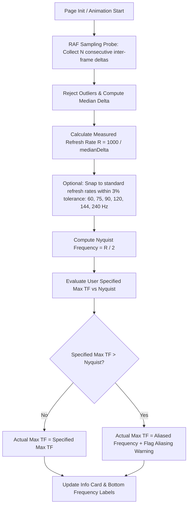

# Implementation Plan & Architectural Reference

**File**: `agy_plan.md`  
**Workspace**: `/Users/alex/Documents/Teaching/3013_PerceptualSystems/CSF-visualize`  
**Rule Compliance**: Saved in workspace with `agy` and `plan` in filename; substantive parameters in `config.js`.

---

## 1. Architectural & Theoretical Reference: Logic of Temporal Frequency Modulation

### 1.1 Psychophysical & Perceptual Foundations
In visual psychophysics (e.g., Robson 1966; Kelly 1979), human contrast sensitivity is spatiotemporally coupled ($S(f_s, f_t)$):
- **Static Grating ($0\text{ Hz}$):** The spatial Contrast Sensitivity Function (CSF) is **bandpass**, peaking at 2–4 cycles per degree (cpd) and falling off sharply at both low and high spatial frequencies.
- **Dynamic Grating ($>0\text{ Hz}$):** At moderate-to-high temporal frequencies (e.g., 6–15 Hz), low-spatial-frequency attenuation decreases or disappears, turning the spatial CSF into a **low-pass** shape. However, sensitivity at high spatial frequencies declines rapidly as flicker speed increases.
- **Visual Goal:** The application allows interactive inspection of this spatiotemporal envelope across strips of descending contrast and across a horizontal spatial chirp, demonstrating how flicker reshapes the envelope of visibility.

### 1.2 Mathematical Formulation: Counterphase Flicker
Temporal modulation is implemented as **counterphase sinusoidal flicker** (standing wave modulation) rather than directional drift:
$$\text{temporalFactor}(x, t) = \cos(2\pi \cdot f_t(x) \cdot t)$$
$$\Delta L(x, y, t) = \text{stripContrast}(y) \times L_{\text{mid}} \times \text{temporalFactor}(x, t)$$
$$L(x, y, t) = L_{\text{mid}} + \Delta L(x, y, t) \times \sin(\phi_{\text{spatial}}(x))$$
- **Counterphase Flicker vs. Drift:** The spatial luminance pattern maintains stationary bar positions and reverses polarity at twice the temporal frequency ($2f_t$), crossing zero modulation ($\Delta L = 0$, uniform mid-grey) twice per temporal cycle. This eliminates directional motion bias.

### 1.3 Horizontal Distribution & Gradient Logic
Temporal frequency varies along the horizontal axis $x$, matching the spatial frequency axis:
- **Min + Delta Parameterization:** The user controls $f_{t,\min}$ (left edge) and $\Delta f_t$ (range), where $f_{t,\max} = f_{t,\min} + \Delta f_t$. Setting $\Delta f_t = 0$ guarantees a spatially uniform temporal flicker across the whole display.
- **Linear Spacing:** $f_t(x) = f_{t,\min} + \Delta f_t \cdot \left(\frac{x}{W}\right)$.
- **Logarithmic Spacing & Zero-Floor Handling:** When $f_{t,\min} > 0.01\text{ Hz}$:
  $$f_t(x) = f_{t,\min} \cdot \left(\frac{f_{t,\max}}{f_{t,\min}}\right)^{x / W}$$
  When $f_{t,\min} = 0$, to resolve $\log(0)$, column $x=0$ is pinned to static ($\text{temporalFactor} = 1.0$), and $x > 0$ uses a configurable floor $\text{floorTF} = \min(\text{minLogTemporalFreq}, f_{t,\max})$ with default $0.1\text{ Hz}$:
  $$f_t(x) = \text{floorTF} \cdot \left(\frac{f_{t,\max}}{\text{floorTF}}\right)^{x / W}$$
- **Decoupled Column Phase:** Unlike spatial frequency (which requires integrating phase across $x$ to avoid chirp distortion), each vertical column $x$ acts as an independent temporal oscillator $\cos(2\pi f_t(x) t)$.

### 1.4 Rendering & Animation Architecture
- **On-Demand Animation Loop:** When $f_{t,\min} = 0$ and $\Delta f_t = 0$, `cancelAnimationFrame` stops the render loop and a single static frame is drawn at $t=0$, conserving CPU/GPU resources and battery. When temporal modulation is activated, `requestAnimationFrame` runs with high-resolution timestamps.
- **Buffer Precomputations:** 
  - `sinChirp` (spatial) and `temporalFactor` (temporal) 1D arrays are computed once per frame.
  - Pixel rows for each contrast strip are generated into a single-row `Uint32Array` buffer with gamma correction ($L \to \text{RGB}$) and copied into the canvas image buffer via `TypedArray.prototype.set()`.

### 1.5 Hardware Limits & The Temporal Aliasing Problem
- **Slider Range ($0\text{ to }50\text{ Hz}$):** Human Critical Flicker Fusion (CFF) occurs around 40–60 Hz at typical monitor luminance levels.
- **Display Refresh Constraints:** Because web browsers render via display V-Sync (commonly 60 Hz or 120 Hz), the Nyquist-Shannon limit ($f_{\text{Nyquist}} = R/2$) limits the maximum un-aliased temporal frequency physically displayable.

---

## 2. Implementation Plan: Measured Webpage Refresh Rate & Actual Highest Temporal Frequency

### 2.1 Goal Description
Currently, the UI displays the *user-specified* temporal frequency (up to 50 Hz). However, on a 60 Hz monitor, any flicker above 30 Hz ($R/2$) cannot be physically presented without **temporal aliasing** (e.g., 40 Hz aliases to 20 Hz, 55 Hz aliases to 5 Hz, 60 Hz appears static).

This feature will:
1. Dynamically measure the browser's actual display refresh rate $R$ (in Hz/FPS) via a high-precision `requestAnimationFrame` timing probe.
2. Determine the physical Nyquist ceiling:
   $$f_{\text{Nyquist}} = \frac{R}{2}$$
3. Display the **actual highest temporal frequency** on the display:
   - If specified $f_{t,\max} \le f_{\text{Nyquist}}$: Actual is equal to specified.
   - If specified $f_{t,\max} > f_{\text{Nyquist}}$: Display the aliased / effective frequency:
     $$f_{\text{actual}} = |f_{\text{specified}} - R \cdot \operatorname{round}(f_{\text{specified}} / R)|$$
     accompanied by an explicit aliasing warning indicator.
4. Add live readouts for **Screen Refresh Rate** and **Nyquist Limit** in the sidebar Info Card, and adjust the bottom frequency axis to show the actual delivered frequency.

---

### 2.2 Mathematical & Sampling Logic

Given measured refresh rate $R$:
- **Sampling Interval:** $\Delta t_{\text{frame}} = 1 / R$.
- **Nyquist-Shannon Boundary:** The highest frequency un-aliased sinusoidal modulation is $f_{\text{Nyquist}} = R / 2$ (e.g., 30 Hz for a 60 Hz screen; 60 Hz for a 120 Hz ProMotion screen).
- **Effective / Aliased Frequency:** For a discrete sampled cosine at frame steps $n = 0, 1, 2, \dots$ with timestamp $t_n = n / R$:
  $$\cos(2\pi f t_n) = \cos\left(2\pi \frac{f}{R} n\right)$$
  The apparent frequency folded back into $[0, R/2]$ is:
  $$f_{\text{apparent}} = \left| f - R \cdot \operatorname{round}\left(\frac{f}{R}\right) \right|$$

---

### 2.3 Proposed Architecture & Workflow


```mermaid
flowchart TD
    A[Page Init / Animation Start] --> B[RAF Sampling Probe: Collect N consecutive inter-frame deltas]
    B --> C[Reject Outliers & Compute Median Delta]
    C --> D[Calculate Measured Refresh Rate R = 1000 / medianDelta]
    D --> E[Optional: Snap to standard refresh rates within 3% tolerance: 60, 75, 90, 120, 144, 240 Hz]
    E --> F[Compute Nyquist Frequency = R / 2]
    F --> G[Evaluate User Specified Max TF vs Nyquist]
    G --> H{Specified Max TF > Nyquist?}
    H -- No --> I[Actual Max TF = Specified Max TF]
    H -- Yes --> J[Actual Max TF = Aliased Frequency + Flag Aliasing Warning]
    I --> K[Update Info Card & Bottom Frequency Labels]
    J --> K
```

---

### 2.4 User Review Required
> [!IMPORTANT]
> **Refresh Rate Measurement without Continuous Burning:**
> When the grating is static (0 Hz), the animation loop is halted. To measure the display refresh rate without running a continuous animation loop:
> - A calibration probe will run for 40 frames (~600ms at 60 Hz) on initial page load (or upon window move/screen change) to establish the monitor refresh rate $R$.
> - Once calibrated, the probe stops, and the detected refresh rate is cached in `state.measuredRefreshRate`.
> - During active temporal animation, the frame rate is periodically sampled in the background to ensure detection if the window moves across displays (e.g. 60 Hz external monitor vs 120 Hz laptop screen).

> [!WARNING]
> **Labeling Format for Aliased Frequencies:**
> When a user requests 40 Hz on a 60 Hz monitor:
> - Should the bottom right frequency label display:
>   `TF: 20.0 Hz (aliased from 40.0 Hz)` or `TF: 20.0 Hz ⚠️`?
> - The proposed implementation displays the true physical frequency with an alert styling and a detailed readout in the sidebar Info Card.

---

### 2.5 Proposed Changes

#### Component: Configuration (`config.js`)
Add substantive parameters for refresh rate sampling:
```javascript
// Temporal frequency calibration & refresh rate measurement
fpsProbeFrames: 40,            // Number of consecutive RAF frames to sample
fpsMinValidDeltaMs: 4.0,       // Minimum valid delta (reject duplicate callbacks < 250 Hz)
fpsMaxValidDeltaMs: 40.0,      // Maximum valid delta (reject tab-switch stalls > 25 Hz)
snapStandardFps: true,         // Snap within ±3% to 60, 75, 90, 120, 144, 165, 240 Hz
standardFpsList: [60, 75, 90, 120, 144, 165, 240],
defaultFallbackFps: 60.0       // Default assumption before probe completes
```

#### Component: UI & Layout (`index.html` & `style.css`)
- In `.info-card`, add rows:
  - `Display Refresh Rate:` `<strong id="infoRefreshRate">Measuring...</strong>`
  - `Nyquist Limit (Max True TF):` `<strong id="infoNyquistLimit">-</strong>`
  - `Actual Max TF (Right):` `<strong id="infoActualMaxTF">-</strong>`
- Add an alert badge `#aliasingWarning` that appears if specified $f_t > f_{\text{Nyquist}}$.

#### Component: Measurement & Rendering Logic (`script.js`)
1. Implement `measureRefreshRate(callback)`:
   - Uses `requestAnimationFrame` to record timestamps of $N$ consecutive frames.
   - Computes differences $\Delta t_i = t_i - t_{i-1}$, sorts them to find the median.
   - Snaps to standard frequencies if within 3%.
2. Implement `getActualTemporalFreq(specifiedTF, refreshRate)`:
   - Returns `{ actualTF, isAliased, nyquist }`.
3. Update `drawBottomFrequencyLabels()`:
   - If aliasing occurs at any label point, format label as e.g. `${actualTF.toFixed(1)} Hz*` or `Act: ${actualTF.toFixed(1)} Hz (Spec: ${specifiedTF.toFixed(1)} Hz)`.
4. Update `updateInfo()`:
   - Populate refresh rate, Nyquist limit, and actual delivered frequency.

---

### 2.6 Verification Plan

#### Automated & Syntax Tests
- Run `node -c config.js` and `node -c script.js` (or JXA syntax check).
- Unit test `getActualTemporalFreq()` across test cases:
  - 60 Hz screen: 20 Hz -> 20 Hz (unaliased)
  - 60 Hz screen: 30 Hz -> 30 Hz (unaliased Nyquist limit)
  - 60 Hz screen: 40 Hz -> 20 Hz (aliased)
  - 60 Hz screen: 60 Hz -> 0 Hz (stroboscopic freeze)
  - 120 Hz screen: 45 Hz -> 45 Hz (unaliased)

#### Manual In-Browser Verification
1. **Refresh Rate Calibration:** Open `index.html`. Verify that within 1 second of loading, the Info Card displays the screen's actual refresh rate (e.g. 60 Hz or 120 Hz) without leaving an active animation loop running when $f_t = 0$.
2. **Sub-Nyquist Range:** Set `minTemporalFreq = 5 Hz`, `deltaTemporalFreq = 15 Hz` ($f_{t,\max} = 20\text{ Hz}$). Verify actual matches specified with no aliasing warning.
3. **Super-Nyquist Range:** On a 60 Hz display, set `minTemporalFreq = 0 Hz`, `deltaTemporalFreq = 40 Hz`. Verify actual max TF shows 20 Hz, an aliasing warning is displayed, and the rightmost bottom label clarifies the delivered 20 Hz frequency.
4. **URL Sharing Compatibility:** Verify that parameters continue to sync cleanly to URL without errors.

---

## 3. Specification & Implementation: Integer Frames per Cycle Quantization ($R / N$ Harmonics)

### 3.1 Psychophysical Rationale
In visual psychophysics, presenting counterphase flicker at arbitrary real-numbered frequencies (e.g. 7.3 Hz on a 60 Hz monitor) yields fractional frames per cycle ($60 / 7.3 \approx 8.22\text{ frames}$). This results in a non-repeating discrete sequence of sampled phases across consecutive cycles, generating phase jitter and stroboscopic beating artifacts.

By restricting temporal frequencies to subharmonics of the monitor refresh rate:
$$f_t = \frac{R}{N}, \quad N \in \{2, 3, 4, 5, 6, 7, 8, 9, 10, 12, 14, 15, 16, 20, 24, 30, 40, 60, 120\}$$
each complete flicker cycle consists of exactly $N$ monitor refresh frames:
- $N = 2$ frames/cycle $\implies R/2 = 30.0\text{ Hz}$ (Nyquist limit: 1 frame positive, 1 frame negative)
- $N = 3$ frames/cycle $\implies R/3 = 20.0\text{ Hz}$
- $N = 4$ frames/cycle $\implies R/4 = 15.0\text{ Hz}$
- $N = 5$ frames/cycle $\implies R/5 = 12.0\text{ Hz}$
- $N = 6$ frames/cycle $\implies R/6 = 10.0\text{ Hz}$
- $N = 8$ frames/cycle $\implies R/8 = 7.5\text{ Hz}$
- $N = 10$ frames/cycle $\implies R/10 = 6.0\text{ Hz}$
- $N = 12$ frames/cycle $\implies R/12 = 5.0\text{ Hz}$
- $N = 15$ frames/cycle $\implies R/15 = 4.0\text{ Hz}$
- $N = 20$ frames/cycle $\implies R/20 = 3.0\text{ Hz}$
- $N = 30$ frames/cycle $\implies R/30 = 2.0\text{ Hz}$
- $N = 60$ frames/cycle $\implies R/60 = 1.0\text{ Hz}$

This eliminates all sampling beating and ensures mathematically pure periodic presentation.

### 3.2 Implementation Architecture
1. **Configurable Parameters (`config.js`)**:
   - `CONFIG.temporalStepMode`: `'continuous'` (default) or `'integerFrames'`
   - `CONFIG.supportedFrameDivisors`: Array of integer frame counts $N$
2. **Interactive UI (`index.html`)**:
   - Add a dropdown for `Temporal Quantization` under the Temporal Frequency Gradient section:
     - `Continuous (0.5 Hz)`
     - `Integer Frames/Cycle (R/N)`
3. **Snapping & Dynamic Feedback (`script.js`)**:
   - `snapToFrameHarmonic(hz)` finds the nearest valid $R/N$ frequency and its frame count $N$.
   - When `temporalStepMode === 'integerFrames'`:
     - Dragging sliders snaps to the nearest harmonic.
     - Slider text readouts show both frequency and exact frames/cycle: e.g. `15.0 Hz (4f/cyc)`.
     - Bottom axis labels show the frame count: `TF: 15.0 Hz (4f)`.
     - Info Card readout updates: `Actual max TF: 15.0 Hz (4 frames/cyc)`.

---

## 4. Implementation Plan: Temporal Strip Width Parameter, Mandatory Integer Frames & 500ms Readout Throttling

### 4.1 How Temporal Frequency Changes Across Width (Current vs. Proposed)
* **Current Behavior:**
  In `renderGrating()`, the column loop advances pixel-by-pixel:
  ```javascript
  const deltaTF = state.deltaTemporalFreq / gratingPhysW;
  for (let x = 0; x < gratingPhysW; x++) {
    const localTF = state.minTemporalFreq + deltaTF * x;
    temporalFactor[x] = Math.cos(2 * Math.PI * localTF * tSec);
  }
  ```
  Every single physical pixel column ($x = 0, 1, 2, \dots$) calculates a unique, continuous floating-point frequency. Thus, each temporal frequency is currently **exactly 1 physical pixel wide** ($1 / \text{dpr}$ CSS pixels).
* **Proposed Behavior:**
  Introduce `temporalStripWidth` (in CSS pixels, e.g. default 20 px, adjustable 1 to 100 px):
  - Just as contrast is grouped vertically into horizontal strips of `stripHeight` pixels, the temporal frequency gradient will be partitioned horizontally into vertical strips/bands of `temporalStripWidth` pixels.
  - Across any pixel $x$, the local strip index is $b = \lfloor x_{\text{css}} / \text{temporalStripWidth} \rfloor$.
  - The nominal frequency at that strip is snapped to the nearest integer frames/cycle harmonic ($R/N$):
    $$f_{t,\text{strip}} = \text{snapToFrameHarmonic}(f_{t,\text{nominal}}).\text{hz}$$
  - All pixels within that vertical strip oscillate synchronously at the exact same discrete integer frame rate.

### 4.2 Removing the Temporal Quantization Dropdown
- Since the app will **always use integer frames/cycle ($R/N$)**, the dropdown is redundant.
- Remove `<select id="temporalStepMode">` from `index.html`.
- Remove `temporalStepMode` state switching; enforce integer frames/cycle globally across all temporal calculations.
- Add a new slider for **Temporal Strip Width** (`temporalStripWidth`) in the Temporal Frequency Gradient section of the sidebar.

### 4.3 Throttling Live Readouts to 500 ms (Half-Second)
* **Current Overhead:**
  - `updateInfo()` is triggered on every slider movement, repeatedly querying and mutating DOM nodes.
  - In `animationLoop()`, `renderGrating()` repeatedly invokes `drawBottomFrequencyLabels()` on every single animation frame (60–120 times/second), re-rasterizing canvas text even though frequency labels are static from frame to frame.
* **Proposed Optimization:**
  - Throttle DOM readout updates and dynamic temporal readout refresh to a 500 ms interval:
    ```javascript
    let lastReadoutUpdateTime = 0;
    if (now - lastReadoutUpdateTime >= 500) {
      updateThrottledReadout();
      lastReadoutUpdateTime = now;
    }
    ```
  - Only re-render canvas text overlays when dimensions or frequency parameters actually change, rather than every 8.3ms/16.6ms frame.
